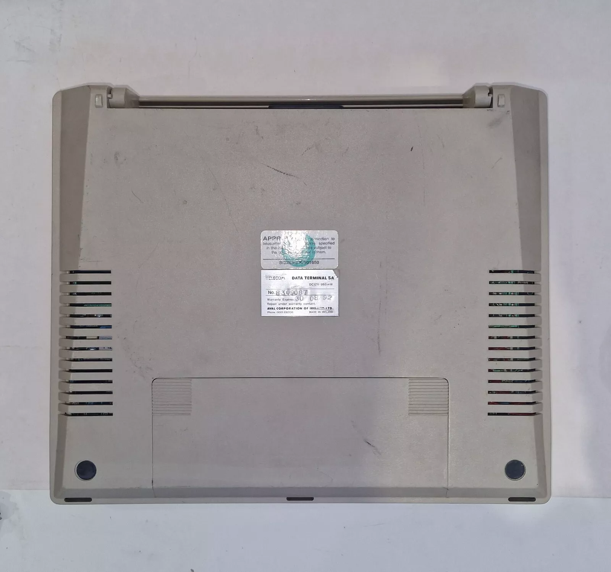

# Aval-TM20 / British Telecom Data Terminal 5A
Repository of information I have gathered in relation to the Aval TM-20 Data Terminal a.k.a. BT Data Terminal 5A 

## Background

My father worked for British Telecom (BT) from the early 70's to the early 00's. During the 1990's i discovered modems and Bulletin Board Systems (BBS), and one day my fahter brought home a British Telecom Data Terminal 5A which i was allowed to use over the weekends.

I used for a few years and eventually swapped it for an Ethernet card for a 68k Macintosh.

A few years ago I noticed one was for sale on Ebay (it being the Aval TM-20, which as far as I can see is identical to the BT Data Terminal 5A), it appeared brand new in the box but the American based seller wanted over $1000 dollars for it, which is way too much - it'll probsably still be for sale when you read this!.

Recently, on a whim i searched again on Ebay and found one for sale (this being the BT Data Terminal 5A) which was quite local to myself (Scotland) an for a price i could live with. Being so local, it may even be the one that I swapped all those years ago.

## The BT Data Terminal 5A

<table>
  <tr>
    <td></td>
    <td></td>
    <td></td>
  </tr> 
  <tr>
    <td></td>
    <td></td>
    <td></td>
  </tr>
    <tr>
    <td></td>
    <td></td>
    <td></td>
  </tr>
</table>

### Power

The main battery (Panasonic Recharable Battery LCS-2012APC (12v,2Ah/10HR)) is dead, and does not want to take a charge. I believe it is a Lead Acid battery that was also used in early camcorders. It is not required to get the device to function as it also accepts a 17v centre positive DC adaptor. The one I have is not original, but powers the device up fine.

I have not taken it apart but I believe there may be an internal battery of some sort to maintain data while it was powered off. The device does allow for the creation of local files, of which there a zero present, so it makes sense that all may have been lost due to a dead battery - it may however have relied on the 12v battery.

### Microchips

There are two hatches on the device, one on top to acces the 12v battery, and one underneath which gives access to some of the Microchips used by the device:

From Left to Right:

- 73K222L-IP - 28 Legs - [Texas Instruments High-Performance Analog Modem, 1.2kbps Data, PDIP28](https://www.datasheets360.com/part/detail/73k222l-ip/-7027777497342069690/)
- HD64B180ROP - 64 legs - [Hitachi HD64180](https://en.wikipedia.org/wiki/Hitachi_HD64180)
- Mitsubishi M5M5256BP-12L - 28 Legs - [SRAMs](https://www.datasheets360.com/part/detail/m5m5256bp-12l/-5477830864292794419/)
- D27C020 [Label: SPOTLINK SYS V3.06 Aval Data Corporation] - 32 Legs - [Intel CHMOS EPROM](https://datasheet.ciiva.com/26786/d27c020-150v10-26786206.pdf)
- Mitsubishi M5M5256BP-12L - 28 Legs - As above

Various Texas Instruments discreet logic chips (AND/NAND/...)

### EPROM

I dumped the eprom using a XGECU T48 the resulting BIN and HEX can be found in the dump folder of this project.

### SPOTLINK

Spotlink is the name of the "Operating System" if that is an appropriate name.

Spotlink ....

At the moment, almost everything you try results in a "bad verb" error. I have dumped the eprom to search and see if any commands can be figured out.
I will make an attempt at decompilation, but that's not in my wheel house.

### Serial port

The aval has a 25 Pin serial port, so with the appropriate null modem cable you can use the device as a
dumb terminal.

By default, the serial port is 4800 baud 8N1

#### Terminal Login to Linux via serial

Connect the aval, via the null modem cable, to a serial port on a linux machine.
The example assumes the serial port on the Linux machine is /dev/ttyUSB0.

- Press either LINE (F1) or CALL (F6) on the aval
- Issue the following on the linux machine `sudo stty -F /dev/ttyUSB0 4800`
- Followed by `systemctl start serial-getty@ttyUSB0.service`
- And the Linux login should appear on the aval
- And to stop when complete `systemctl stop serial-getty@ttyUSB0.service`

This video on youtube logging into a linux machine via a BBC B gave me most of the info I needed to get this working.

[linux wednesday's #81 Terminal Login via serial](https://www.youtube.com/watch?v=CMi_Y4WfvWA)

### HEX Editor 

Using a hex editor you can browse the dumped .BIN file for text.

### Links

https://www.eevblog.com/forum/beginners/how-to-drive-a-old-controllerless-lcd-hitachi-lm236xb/

https://www.techmonitor.ai/technology/aval_to_supply_spotlinks_to_lm_ericsson/
> Aval Corp, the Irish-based European arm of Aval International of Japan is to supply up to 200 of its Spotlink portable terminals to LM Ericsson for remote phone servicing.